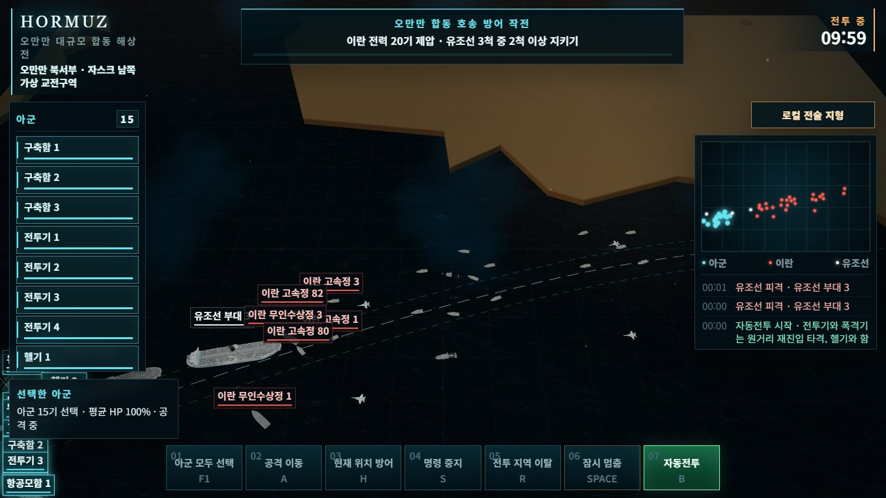
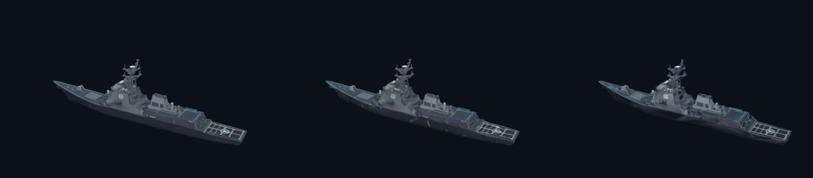
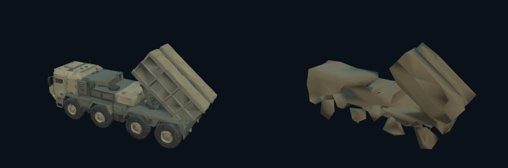
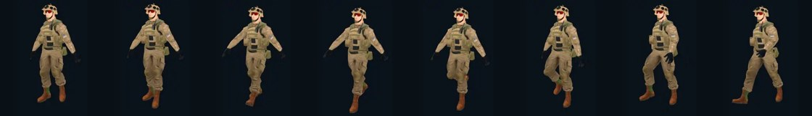

# 3D 모델을 브라우저 게임에 붙이는 법

「호르무즈」를 만들면서 실제로 겪은 것만 적었다. 일반론은 없다.
모든 숫자는 이 저장소의 코드를 헤드리스 브라우저로 돌려서 잰 값이다.

**In short (English):** This is a field guide to shipping 3D models in a browser
game — how the LOD ladder is built, how skeletal animation is split across files,
which glTF optimisations are safe and which silently destroy your geometry, and
how all of it is verified automatically. Every number below was measured by
running this repository in a headless browser.

---

## 만든 것



브라우저에서 바로 도는 3D 실시간 전략 게임이다. 설치도 플러그인도 없다.

위 화면의 실측값:

| | |
|---|---|
| 화면 위 유닛 | 44기 |
| 한 프레임 삼각형 | 76,545 |
| 드로우콜 | 39 |

프레임워크는 쓰지 않았다. 순수 자바스크립트와 three.js 뿐이다.

---

## 1. 예산부터 정한다

모델을 고르기 전에 **한 프레임에 몇 개까지 그릴지**를 먼저 정했다.

```
삼각형  120,000
드로우콜     90
```

이 숫자는 감이 아니라 하한선이다. 노트북 내장 그래픽에서도 끊기지 않는 선을
찾아서 박아 놓고, 그 뒤로는 **넘으면 빌드가 실패하게** 만들었다.

```
python tools/validate-rts-scenarios.py
```

이 검사가 없으면 모델을 하나 예쁘게 바꿀 때마다 조금씩 무거워지는데,
어느 순간부터 느려졌는지 아무도 모르게 된다. 숫자를 정해 두면 바로 그날 잡힌다.

> **In short:** Set a triangle and draw-call budget *before* choosing models, and
> make the build fail when it is exceeded. Otherwise the slowdown creeps in
> unnoticed, one "small" upgrade at a time.

---

## 2. 같은 대상을 여러 벌 만든다

이게 이 프로젝트에서 가장 크게 먹힌 것이다.



셋 다 같은 배다. 왼쪽부터:

| 판본 | 삼각형 | 언제 쓰나 |
|---|---:|---|
| `naval_destroyer_high` | 41,000 | 화면에 한두 척, 가까이 |
| `naval_destroyer_squad` | 9,333 | 여러 척이 함께 움직일 때 |
| `naval_destroyer_low` | 3,057 | 멀리, 점처럼 보일 때 |

원본만 쓰면 배 세 척에 123,000 삼각형이다. 예산이 12만이니 세 척으로 끝난다.
분대용으로 바꾸면 같은 예산에 열세 척이 들어간다.

**화면에서 작아 보이면 아무도 차이를 모른다.** 그게 전부다.

### 다만 정직해야 한다



왼쪽이 19,545 삼각형, 오른쪽이 707이다. 오른쪽은 **가까이서 보면 뭉개져 있다.**

이건 결함이 아니라 용도다. 화면에서 20픽셀로 보일 때 쓰라고 만든 것이다.
다만 이런 걸 "저해상도 판본"이라고만 적어서 넘기면 받은 사람이 불량품으로 안다.
**어느 거리에서 쓰는 것인지 반드시 같이 적어야 한다.**

> **In short:** Ship the same asset at several densities. A destroyer at 41k
> triangles caps you at three ships; the 9.3k version fits thirteen in the same
> budget, and at typical screen size nobody can tell. But label the far-LOD
> honestly — at close range it looks broken, because it was never meant to be
> seen there.

---

## 3. 같은 것이 수십 개면 하나로 그린다

고속정 스무 척을 각각 그리면 드로우콜 스무 번이다. 삼각형이 적어도 이건 느리다.

같은 모델을 여러 번 놓을 때는 `InstancedMesh` 로 묶어서 **한 번에** 보낸다.

```js
const mesh = new THREE.InstancedMesh(geometry, material, count);
for (let index = 0; index < count; index += 1) {
  matrix.compose(position[index], rotation[index], scale);
  mesh.setMatrixAt(index, matrix);
}
mesh.instanceMatrix.needsUpdate = true;
```

위 전투 화면이 유닛 44기에 드로우콜 39인 이유가 이것이다.
묶지 않았다면 200을 넘었을 것이다.

이 게임에서는 `strategic-instance-*` 라는 이름으로 붙어 있다.
`assets/js/rts-combat.js` 에서 그 이름으로 찾으면 된다.

> **In short:** Twenty identical boats drawn separately cost twenty draw calls.
> `InstancedMesh` makes it one. That is why 44 units cost 39 draw calls here.

---

## 4. 몸과 동작은 따로 둔다



보병 모델과 걷는 동작은 **다른 파일**에 들어 있다.

```
ground_soldier_a_base.glb        몸 (뼈대 포함)
ground_soldier_a_walk_anim.glb   걷는 동작만 (몸 없음)
ground_soldier_a_combat.glb      쏘며 전진하는 동작
```

붙이는 코드는 이게 전부다.

```js
const body = await loader.loadAsync('ground_soldier_a_base.glb');
const walk = await loader.loadAsync('ground_soldier_a_walk_anim.glb');

const mixer = new THREE.AnimationMixer(body.scene);
mixer.clipAction(walk.animations[0]).play();
```

**뼈 이름이 같으면 그냥 붙는다.** 다른 파일에서 온 동작이라는 걸 three.js 는
신경쓰지 않는다. 이름으로 찾아서 맞물린다.

왜 나눠 두나 — 병사가 두 종류인데 동작은 같다. 합쳐 두면 같은 동작을 두 번
내려받는다. 나눠 두면 동작 파일 하나를 둘이 같이 쓴다.

### 여기서 한 번 틀렸다

걷는 동작이 **서 있을 때도 재생됐다.** 속도값으로 판정했기 때문이다.
멈추라는 명령을 받아도 속도가 완전히 0이 되기 전까지 계속 걸었고,
제자리에서 밀칠 때도 걸었다.

고친 방법 — 속도를 보지 말고 **0.5초 동안 실제로 이동한 거리**를 본다.

```js
const PROGRESS_WINDOW = 0.5;
rig.progressSpeed = planarDistance(unit.position, rig.progressAnchor) / span;
const moving = (rig.progressSpeed || 0) > unit.definition.speed * 0.08;
```

제자리에서 아무리 밀려도 0.5초 뒤 위치가 그대로면 걷지 않는다.

> **In short:** Keep the mesh and the animation clips in separate files — clips
> bind by bone name, so a clip loaded from another file just works, and two
> different characters can share one clip file. Also: drive the walk cycle from
> *distance actually covered over 0.5s*, not from the velocity value. Velocity is
> non-zero while a unit is being shoved around in place.

---

## 5. 무게 줄이기 — 되는 것과 하면 안 되는 것

### 되는 것: 질감을 WebP 로

```
npx @gltf-transform/cli webp input.glb output.glb
```

이것만으로 모델 용량이 **33%** 줄었다. 눈으로 차이를 못 느낀다.

전투 하나가 내려받는 양은 지금 **12.1~19.3MB** 다
(`python tools/audit-load-cost.py` 로 잰 값).

### 하면 안 되는 것: 이미 압축된 모델에 meshopt 를 또 걸기

```
npx @gltf-transform/cli meshopt input.glb output.glb    # ← 조심
```

이걸 걸었더니 **헬기 몸체가 통째로 사라지고 프로펠러만 남았다.**

원인은 좌표를 두 번 압축한 것이다. Meshy 에서 나온 모델은 이미 좌표가 정수로
줄여져 있었는데, 거기에 또 걸면서 좌표 범위가 무너졌다.

```
정상:   16316 × 4333 × 16383
망가짐:     0 ×    0 × 32767      ← 두께가 0 이 됐다
```

**무서운 건 삼각형 수가 그대로였다는 것이다.** 삼각형만 세는 검사는 이걸 통과시킨다.
사장님이 화면에서 발견하기 전까지 아무도 몰랐다.

### 그래서 검사를 하나 더 만들었다

삼각형 수만 보지 말고 **좌표 범위의 비율**을 같이 본다.
어느 한 축이 눌려서 납작해지면 걸린다.

```
python tools/optimize-used-models.py
```

meshopt 를 포기하면서 절감률은 56%에서 33%로 떨어졌다. 대신 모델이 안 망가진다.
**덜 줄이고 안 깨지는 쪽이 맞다.** 위의 12.1~19.3MB 는 그 선택을 하고 난 뒤의 값이다.

> **In short:** Texture → WebP is free money (33% here). But do *not* run
> `meshopt` on geometry that is already quantised — it re-quantises and can
> collapse an axis to zero. We lost a helicopter fuselage that way, and the
> triangle count was **unchanged**, so a triangle-count check passed it happily.
> Guard on bounding-box axis ratios, not just triangle counts.

---

## 6. 눈으로 확인하지 말고 재라

이 프로젝트의 모든 주장은 스크립트가 뒷받침한다.

```
python tools/validate-rts-scenarios.py   시나리오 7개가 다 클리어 가능한가
python tools/audit-smoothness.py         프레임이 끊기는 지점과 원인
python tools/audit-load-cost.py          전투별 내려받는 용량
python tools/audit-combat-units.py       전투 객체가 제대로 보이는가
```

전부 헤드리스 브라우저로 게임을 실제로 띄워서 잰다.

### 측정 환경에는 그래픽카드가 없다

그래서 **초당 프레임 절대값은 믿지 않는다.** 대신 이 둘은 환경과 거의 무관하다.

- **한 프레임이 100ms 넘게 멈추는 횟수** — 그릴 게 많아서가 아니라 그 순간
  뭔가를 불러오기 때문에 생긴다.
- **시간이 갈수록 나빠지는가** — 메모리와 프레임 시간이 계속 늘면 새는 곳이 있다.

절대 속도가 아니라 **끊김과 악화**를 본다. 이건 어느 기계에서 재도 같다.

### 측정이 PC를 잡아먹는 문제

헤드리스 크롬 여럿을 동시에 띄우면 작업용 PC가 마비된다.
그래서 도구를 하나 만들었다.

```
python tools/run-quiet.py --cores 6 python tools/audit-smoothness.py
```

자식 프로세스를 지정한 코어 수에만 묶고 우선순위를 낮춘다.
크롬이 스스로 이 설정을 되돌리기 때문에 0.4초마다 다시 건다.

> **In short:** Every claim in this repo is backed by a script that boots the
> real game headlessly. The measurement box has no GPU, so absolute FPS is
> meaningless — instead we track *stall count* and *degradation over time*, both
> of which transfer across machines. `tools/run-quiet.py` pins the headless
> Chromes to a core subset so the workstation stays usable.

---

## 7. 걸려 넘어진 것들

만들면서 실제로 시간을 잡아먹은 것들이다. 남이 같은 데서 안 넘어지길 바란다.

**모델을 연결했는데 여전히 네모난 도형이 나온다**
경로만 적어서는 안 된다. 그 유닛에 `hero: true` 가 같이 있어야 진짜 모델을 쓴다.
없으면 대충 만든 대체 도형이 나온다.

**`strategicLod` 는 저해상도라는 뜻이 아니다**
이름만 보고 "저해상도 판본"인 줄 알고 켰더니 부대 전체가 네모난 로봇이 됐다.
이건 **모델 대신 도형을 쓴다**는 뜻이다. 이름에 속으면 안 된다.

**파일은 고쳤는데 브라우저가 옛것을 쓴다**
`?v=` 를 올려야 한다. 그런데 코드 안에도 판번호가 박혀 있어서
**둘 다 같이 올려야** 한다. 하나만 올리면 검사가 엉뚱한 이유로 실패한다.

**아이콘 하나 넣었더니 칸이 벌어졌다**
`> div:first-child` 같은 선택자로 배치를 잡아 놨는데, 아이콘을 맨 앞에 넣으니
그 선택자가 아이콘을 가리키게 됐다. 글자 칸이 규칙을 잃고 28px 넘쳤다.
**자식 순서에 의존하는 선택자는 언젠가 이렇게 터진다.**

**측정 도구가 거짓말을 했다**
프레임 시간을 벽시계로 쟀더니, 코어를 묶어 놓은 상태에서 준비 시간이 18초로
나와서 "무기를 안 쏜다"는 오진이 나왔다. 실제로는 아직 시작 전이었다.
**게임 시간으로 재야 한다.** 바깥 시계로 재면 측정이 측정을 방해한다.

> **In short:** A wired-up model still renders as a box unless the unit also has
> `hero: true`. `strategicLod` means *substitute primitive*, not *low-poly*.
> Cache-bust version and the in-code runtime pin must be bumped together.
> Selectors keyed on child order (`> div:first-child`) break the day you insert
> an icon. And never measure game readiness with a wall clock while the CPU is
> throttled — measure in simulation time.

---

## 파일 어디를 보면 되나

```
assets/js/rts-combat.js     전투 엔진. 위의 거의 모든 것이 여기 있다
assets/data/rts-combat.json 시나리오·유닛 정의
assets/models/              모델
tools/                      검증·측정 도구
docs/                       측정 결과와 감사 기록
```

모델만 필요하면 별도 배포본 `hormuz-model-pack` 을 받으면 된다.
뷰어가 같이 들어 있어서 받자마자 전부 돌려볼 수 있다.

## 라이선스

코드는 MIT, 모델은 CC BY 4.0. 둘 다 상업적 이용이 가능하다.
