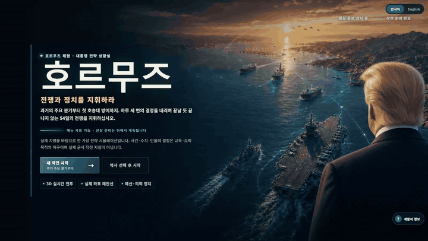
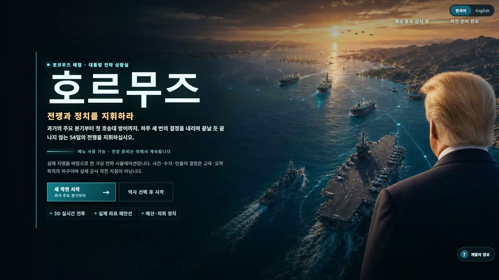
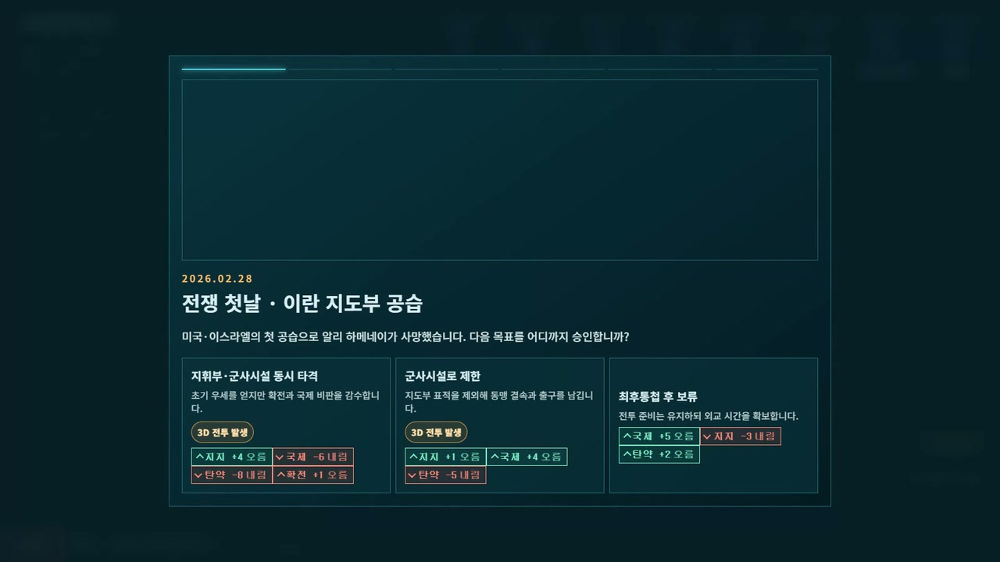
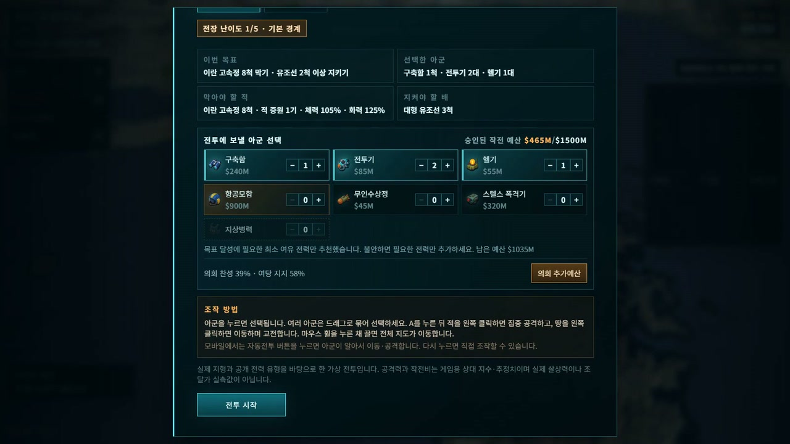
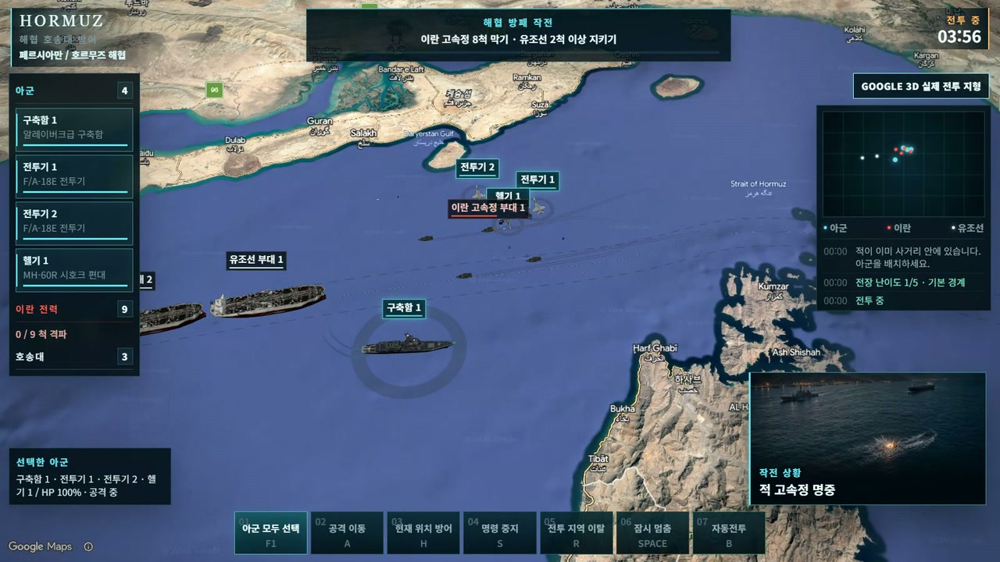

# HORMUZ | 호르무즈

> 호르무즈 해협 위기 속에서 전쟁과 정치를 함께 지휘하는 무료 브라우저 3D 전략 게임<br>
> 기획, 코드, 3D 모델, 이미지 제작과 검증까지 AI와 대화하며 바이브코딩으로 완성한 오픈소스 프로젝트입니다.

설치 없이 링크만 열면 바로 시작할 수 있습니다. 플레이어는 대통령 상황실에서 과거의 주요 결정을 되짚고, 정책·외교·작전 예산을 결정한 뒤, 편성한 전력을 직접 지휘해 3D RTS 전투를 수행합니다.

- **온라인 플레이:** https://watercastlegames.github.io/hormuz/
- **운영 데모:** https://sidak.kr/autodev/GameCreator/hormuz/
- **전투만 바로 체험:** https://watercastlegames.github.io/hormuz/rts-combat.html?scenario=convoy_shield&lang=ko&google=0
- **English:** https://watercastlegames.github.io/hormuz/?lang=en
- **개발자 정보:** https://sidak.kr/autodev/GameCreator/hormuz/developer.html
- **전체 소스:** https://github.com/watercastlegames/hormuz

<p align="center">
  <a href="https://watercastlegames.github.io/hormuz/">
    
  </a>
</p>

<p align="center"><b>이미지를 누르면 브라우저에서 바로 플레이할 수 있습니다.</b></p>

<details>
  <summary><b>타이틀부터 정책 결정·전력 편성·실전 교전까지 29초 하이라이트 보기</b></summary>
  <br>
  <p align="center">
    
  </p>
  <p align="center">
    <a href="assets/media/gameplay-highlight.mp4">720p MP4로 보기</a>
  </p>
</details>

## 어떤 게임인가요?

「호르무즈」는 실제 지리와 공개 보도에서 출발한 **가상 대통령 전략 시뮬레이션 + 3D 실시간 전략 게임**입니다. 과거 사건 재연 이후 시작되는 본편에서 최대 54일 동안 전쟁을 관리하며, 유가·지지율·국제 여론·민간 통항·탄약·확전 수위를 동시에 다뤄야 합니다.

정책 카드의 숫자만 고르는 게임이 아닙니다. 군사 행동을 선택하면 승인 예산 안에서 구축함, 전투기, 헬기, 무인수상정, 항공모함, 스텔스 폭격기와 지상병력을 편성하고 실제 3D 전장으로 들어갑니다. 전투 결과는 다시 정치와 외교 지표에 반영되고, 누적된 선택은 10가지 결말과 최종 점수를 바꿉니다.

이 게임은 교육·오락 목적의 허구 시뮬레이션입니다. 실제 군사 작전, 항해, 투자, 외교 또는 정책 판단 자료가 아닙니다.

## 지금 바로 플레이하기

| 실행 방식 | 주소 | 무엇이 다른가요? |
|---|---|---|
| **GitHub Pages** | [게임 시작](https://watercastlegames.github.io/hormuz/) | 공개 소스와 같은 빌드입니다. API 키 없이 로컬 지형과 무음 폴백으로 실행됩니다. |
| **운영 데모** | [게임 시작](https://sidak.kr/autodev/GameCreator/hormuz/) | 운영용 지도·효과음 설정을 사용하는 공개 데모입니다. |
| **3D 전투 직행** | [호송 방어 전투](https://watercastlegames.github.io/hormuz/rts-combat.html?scenario=convoy_shield&lang=ko&google=0) | 캠페인을 건너뛰고 전력 편성과 RTS 조작부터 체험합니다. |
| **English** | [Play in English](https://watercastlegames.github.io/hormuz/?lang=en) | 같은 페이지에서 문구만 영어로 바뀝니다. |
| **개발자 페이지** | [제작 기록 보기](https://sidak.kr/autodev/GameCreator/hormuz/developer.html) | 제작 방식과 Water Castle Games의 다른 프로젝트를 소개합니다. |

진행 상황은 브라우저 로컬 저장소에 자동 저장됩니다. 같은 브라우저에서 다시 열면 안전 체크포인트부터 이어할 수 있습니다.

## 한 판의 진행 방식

1. **상황실 진입** — 한국 접속자는 한국어, 그 외 지역은 영어로 시작하며 언제든 언어를 바꿀 수 있습니다.
2. **과거 사건 선택** — 전쟁 전개의 분기점이 된 6개 결정을 재연하고 본편 초기 조건을 만듭니다.
3. **일일 브리핑** — 유가, 지지율, 국제 여론, 통항률, 탄약, 확전 수위와 이란의 태세를 확인합니다.
4. **정책·외교 결정** — 35개 정책 카드와 사건 대응에서 그날의 방침을 고릅니다.
5. **작전 예산 승인** — 가용 예산 안에서 전력을 편성하거나 의회의 추가 예산을 요청합니다.
6. **3D RTS 전투** — 부대를 선택하고 이동, 공격 이동, 위치 방어, 명령 중지, 철수 또는 자동전투를 지시합니다.
7. **상대 대응과 대통령 발언** — 전투 결과와 양측의 선택이 다음 날의 정치·외교 환경을 바꿉니다.
8. **종전과 평가** — 최대 54일의 누적 선택을 바탕으로 10개 엔딩 중 하나와 최종 점수를 확인합니다.

## 주요 장면

| 대통령 전략 상황실 | 과거 사건의 선택 |
|---|---|
|  |  |

| 전력 편성과 작전 예산 | Google 3D 지형 위 RTS 교전 |
|---|---|
|  |  |

## 핵심 기능

- **대통령 전략 캠페인** — 정책, 외교, 의회 정치, 작전 예산과 전투 결과가 한 상태로 이어집니다.
- **7개 실제 플레이 전투** — 호송 방어, 방공, 기뢰 제거, 유조선 구조, 연안 포대 제압, 제한 전략 타격, 대규모 함대전을 서로 다른 목표와 전장으로 구성했습니다.
- **개별 유닛 지휘** — 구축함·전투기·헬기처럼 편성 수량이 있는 전력은 화면에서도 각각 생성되고 개별 또는 다중 선택할 수 있습니다.
- **5단계 적응형 난이도** — 날짜, 확전 수위, 연승·패배와 최근 투입 병과를 읽어 적 체력·화력·증원과 대응 편성을 조정합니다.
- **반복 억제** — 최근 전투 이력을 저장해 같은 시나리오와 배치가 연속으로 반복되지 않게 합니다.
- **Google 3D + 로컬 폴백** — API 키가 있으면 Google 3D 지형, 없거나 실패하면 Natural Earth 기반 로컬 지형을 사용합니다.
- **한국어·영어 동시 지원** — 별도 페이지 없이 같은 DOM과 데이터에서 언어만 전환합니다.
- **10개 엔딩과 점수** — 종전 시점과 유가·지지율·국제 여론·통항률·확전도를 종합해 결말과 점수를 계산합니다.
- **저장·복구** — 정책 효과나 일일 결산이 중복 적용되지 않도록 단계별 안전 체크포인트를 저장합니다.
- **PC·모바일 대응** — 데스크톱에서는 직접 RTS 조작, 모바일에서는 터치 선택과 자동전투를 사용할 수 있습니다.
- **런타임 외부 AI 호출 없음** — 게임 진행과 판정은 저장소에 포함된 JavaScript와 JSON 데이터만으로 실행됩니다.
- **정적 호스팅 가능** — 서버 애플리케이션이나 데이터베이스 없이 GitHub Pages 같은 정적 호스팅에서 플레이할 수 있습니다.

## 조작 방법

### PC

| 입력 | 동작 |
|---|---|
| 좌클릭 | 아군 1기 선택, 적군 정보 확인 |
| 드래그 | 여러 아군을 한 번에 선택 |
| 우클릭 | 지점 이동 또는 선택한 적 집중 공격 |
| `F1` | 아군 모두 선택 |
| `A` 후 좌클릭 | 공격 이동 |
| `H` | 현재 위치 방어 |
| `S` | 현재 명령 중지 |
| `R` | 전투 지역 이탈 |
| `Space` | 일시정지 / 재개 |
| `B` | 자동전투 켜기 / 끄기 |
| 마우스 휠 | 전장 확대 / 축소 |

### 모바일

- 유닛과 전장 위치를 탭해 선택·이동합니다.
- 하단의 **자동전투**를 켜면 병과별 유효 사거리와 재공격 경로를 사용해 전투합니다.
- 일시정지 후 전황을 확인하고 다시 직접 명령할 수 있습니다.

## 로컬에서 실행하기

빌드 없이 현재 배포본을 바로 실행할 수 있습니다. ES 모듈과 JSON 로딩 때문에 `file://`로 열지 말고 반드시 로컬 웹서버를 사용하세요.

```bash
git clone https://github.com/watercastlegames/hormuz.git
cd hormuz
python -m http.server 8080
```

브라우저에서 다음 주소를 엽니다.

```text
http://localhost:8080/
```

전투 화면만 열려면:

```text
http://localhost:8080/rts-combat.html?scenario=convoy_shield&lang=ko&google=0
```

Python이 없다면 VS Code Live Server, `npx serve`, Caddy 등 정적 파일을 제공할 수 있는 어떤 서버도 사용할 수 있습니다.

## 공개 빌드에서 알아둘 점

### 지도

이 저장소에는 Google Maps API 키가 들어 있지 않습니다. 기본 상태에서는 로컬 지형으로 자동 전환되며 게임 기능은 그대로 유지됩니다.

실제 Google 3D 지형을 사용하려면 `net/google-maps-config.js`에 본인 키와 Map ID를 설정하세요. 브라우저 키는 사용자에게 공개되므로 반드시 다음 제한을 적용해야 합니다.

- 허용할 웹사이트의 HTTP 리퍼러만 등록
- Maps JavaScript API만 허용
- 일일 할당량과 예산 알림 설정
- 키를 커밋하거나 다른 프로젝트의 키를 재사용하지 않기

### 효과음

운영 게임에서 사용하는 일부 효과음은 ElevenLabs 무료 플랜의 배포 조건 때문에 MIT 공개 저장소에 포함하지 않았습니다. 공개 빌드의 `assets/data/rts-audio.json`은 무음 폴백으로 설정되어 있으며, 직접 라이선스를 확보한 파일을 연결할 수 있습니다.

## 기술 구성

- **UI:** HTML5, CSS, Vanilla JavaScript (ES2020)
- **3D:** three.js r185, glTF/GLB, WebP 텍스처
- **지도:** Google 3D Maps 선택 연동 + Natural Earth 로컬 지형
- **데이터:** JSON 기반 카드·사건·엔딩·임무·전투·다국어 사전
- **저장:** Web Storage (`localStorage`)
- **번들:** esbuild로 IIFE 번들 생성, 실행에는 별도 빌드 불필요
- **호스팅:** GitHub Pages 또는 일반 정적 웹서버
- **개발 방식:** GPT와 대화하는 바이브코딩 + 실제 브라우저 자동 검증

성능 상한은 한 프레임 **삼각형 120,000개, 드로우콜 90회**입니다. 고해상도 원본 모델을 그대로 복제하지 않고 전투용·분대용·원거리용 LOD와 인스턴싱을 사용합니다.

## 프로젝트 구조

```text
hormuz/
├─ index.html                     # 캠페인 진입점
├─ rts-combat.html                # 3D RTS 전투 화면
├─ developer.html                 # 개발자·프로젝트 소개
├─ record.html                    # 브라우저 화면 공유 기반 수동 녹화기
├─ assets/
│  ├─ css/                        # 캠페인·전투·개발자 페이지 스타일
│  ├─ data/                       # 카드, 사건, 엔딩, 임무, 전투, 한·영 사전
│  ├─ js/                         # 캠페인과 RTS 원본 코드·배포 번들
│  ├─ models/                     # 런타임용 최적화 GLB 모델
│  ├─ images/                     # 타이틀·브리핑·정치·무전 이미지
│  ├─ media/                      # GitHub README용 실제 플레이 미디어
│  └─ textures/                   # 로컬 지형 텍스처
├─ net/
│  ├─ google-maps-config.js       # 공개본은 빈 설정
│  └─ google-maps-config.example.js
├─ tools/                         # 빌드, 녹화, 성능·시나리오 자동 검증
├─ docs/
│  ├─ images/                     # README용 실제 플레이 화면
│  └─ guide/                      # 3D 모델·LOD 제작 가이드 이미지
├─ GUIDE.md                       # 브라우저 3D 모델 최적화 실전 기록
├─ CONTRIBUTING.md                # 기여·검증 규칙
├─ ASSET-LICENSES.md              # 자산별 라이선스
├─ DISCLAIMER.md                  # 허구 시뮬레이션 면책
└─ README.md
```

## 나만의 캠페인과 전투로 바꾸기

가장 먼저 볼 파일은 다음과 같습니다.

| 파일 | 바꿀 수 있는 것 |
|---|---|
| `assets/data/cards.json` | 35개 정책 카드, 선택지, 지표 변화 |
| `assets/data/events.json` | 이란 측 사건과 대응 |
| `assets/data/timeline.json` | 과거 사건 6단계와 초기 조건 |
| `assets/data/campaign.json` | 작전 예산, 의회 조건, 캠페인 작전 |
| `assets/data/missions.json` | 7개 전투의 목표와 캠페인 연결 |
| `assets/data/rts-combat.json` | 전투 유닛, 기본 수치, 배치, 한·영 전투 사전 |
| `assets/data/endings.json` | 10개 엔딩 조건과 결과 문구 |
| `assets/data/strings.ko.json` | 본편 한국어 문구 |
| `assets/data/strings.en.json` | 본편 영어 문구 |
| `assets/js/main.js` | 캠페인 상태 머신과 화면 흐름 |
| `assets/js/rts-combat.js` | 선택, 이동, 전투, AI, 판정, 3D 렌더링 |

새로운 화면 문구는 코드에 직접 쓰지 말고 한국어·영어 사전에 함께 추가하세요. 데이터의 한글 필드를 늘릴 때는 대응하는 `En` 필드도 같이 추가해야 합니다.

3D 모델 제작과 LOD·인스턴싱·애니메이션 결합 방법은 [GUIDE.md](GUIDE.md)에 실제 실패 사례와 측정값까지 정리했습니다.

## 소스 빌드

저장소에는 바로 실행할 수 있는 번들이 포함되어 있습니다. 원본 모듈을 수정했다면 두 번들을 다시 만드세요.

```bash
npx --yes esbuild assets/js/main.js \
  --bundle \
  --format=iife \
  --target=es2020 \
  --outfile=assets/js/game.bundle.js

npx --yes esbuild assets/js/rts-combat.js \
  --bundle \
  --format=iife \
  --target=es2020 \
  --outfile=assets/js/rts-combat.bundle.js
```

번들 주소의 `?v=` 캐시 번호와 코드 안의 런타임 버전 핀도 함께 갱신해야 브라우저와 검증 도구가 같은 코드를 봅니다.

## 검증 도구

`tools/`의 스크립트는 실제 브라우저로 게임을 실행해 시나리오, 언어, 저장 복구와 성능 예산을 검사합니다.

```bash
# 7개 RTS 시나리오와 캠페인 연결
python -X utf8 tools/validate-rts-scenarios.py --tag local
python -X utf8 tools/validate-mission-routing.py --tag local

# 한국어·영어와 전체 캠페인 완주
python -X utf8 tools/validate-i18n.py --tag local
python -X utf8 tools/validate-campaign-fullrun.py

# 저장 복구, 적응형 전투, 모델 예산
python -X utf8 tools/validate-save-resume.py --tag local
python -X utf8 tools/validate-adaptive-combat.py --tag local
python -X utf8 tools/glb-tri-count.py --used-only
```

클릭 검증은 `element.click()` 같은 합성 클릭 대신 실제 화면 좌표에 포인터를 보내고 `document.elementFromPoint()`로 가려진 요소가 없는지 확인합니다.

## 문서와 제작 기록

- [브라우저 3D 모델 최적화 가이드](GUIDE.md)
- [게임 기획서](docs/hormuz-game-design.html)
- [화면 구성서](docs/hormuz-screen-design.html)
- [코딩 설계서](docs/hormuz-code-design.html)
- [3D 전장 설계](docs/hormuz-rts-theater-combat-design-v1.0.md)
- [지도 데이터 출처](docs/MAP_SOURCES.md)
- [3D 모델·자산 라이선스](ASSET-LICENSES.md)
- [기여 안내](CONTRIBUTING.md)
- [면책 고지](DISCLAIMER.md)

## 공개와 기여

코드와 문서는 **MIT License**로 공개됩니다. 버그 수정, 모바일 조작 개선, 새로운 사건·전투 구조, 성능 최적화와 문서 보완을 환영합니다.

게임에 포함된 HORMUZ 3D 모델은 **CC BY 4.0**이며 출처 표시가 필요합니다. KayKit 애니메이션, Natural Earth 데이터 등 제3자 자산은 각각의 라이선스를 따릅니다. 자세한 내용은 [ASSET-LICENSES.md](ASSET-LICENSES.md)를 확인하세요.

기여 전에는 [CONTRIBUTING.md](CONTRIBUTING.md)의 다국어·빌드·검증·보안 규칙을 읽어 주세요. API 키, 토큰, 서버 자격 증명과 고해상도 생성 원본은 커밋하지 않습니다.

## 허구 시뮬레이션 안내

이 프로젝트는 공개 보도와 지리를 바탕으로 만든 가상 전략 게임이며 특정 정부, 군, 기업, 인물의 공식 입장이나 승인을 뜻하지 않습니다.

- 실시간 정보, 표적 정보 또는 실제 작전 지침을 제공하지 않습니다.
- 지도와 유닛 위치는 게임을 위해 단순화했으며 항해에 사용할 수 없습니다.
- 전투력, 예산, 피해와 결과는 게임용 상대 지수와 허구적 추정입니다.
- 본편의 사건과 결과는 허구이며 실제 인물의 발언이나 결정을 재현하지 않습니다.

전체 고지는 [DISCLAIMER.md](DISCLAIMER.md)에서 확인할 수 있습니다.

## 개발자의 다른 게임

### 마크의 마지막 수리

사진과 공개 단서를 조사하고 AI 동료·집사와 대화하며 사건의 전말을 완성하는 모바일 중심 미스터리 웹게임입니다.

- [온라인 플레이](https://sidak.kr/autodev/GameCreator/crimeGame/)
- [GitHub 소스](https://github.com/watercastlegames/mark-last-repair)

### SON 키우기 타이쿤 : 아들을 축구 월클선수로

아들을 훈련시키고 커리어를 성장시켜 세계적인 축구 선수로 키우는 모바일 육성 타이쿤 게임입니다.

- [Google Play에서 보기](https://play.google.com/store/apps/details?id=com.SonFootballerTycoon.WaterCastleGames&hl=ko)

<details>
  <summary><b>English summary</b></summary>
  <br>
  <p><b>HORMUZ</b> is a free, open-source browser strategy game that combines a presidential decision campaign with playable 3D RTS battles. Manage oil prices, public support, international opinion, civilian transit, munitions and escalation across a campaign of up to 54 days, then command the forces you funded on the battlefield.</p>
  <ul>
    <li><a href="https://watercastlegames.github.io/hormuz/?lang=en">Play the open-source build in English</a></li>
    <li>Seven playable RTS scenarios, five adaptive difficulty levels and ten endings</li>
    <li>Desktop RTS controls plus touch selection and auto-battle on mobile</li>
    <li>Vanilla JavaScript, three.js, JSON data and static hosting</li>
    <li>Optional Google 3D terrain with a Natural Earth local fallback</li>
    <li>Code and docs under MIT; bundled HORMUZ 3D models under CC BY 4.0</li>
  </ul>
  <p>The game is fictional and is not operational, navigation, investment or policy guidance.</p>
</details>

---

Made with vibe coding by [Water Castle Games](https://github.com/watercastlegames) · [Play HORMUZ](https://watercastlegames.github.io/hormuz/) · [Public source repository](https://github.com/watercastlegames/hormuz)
